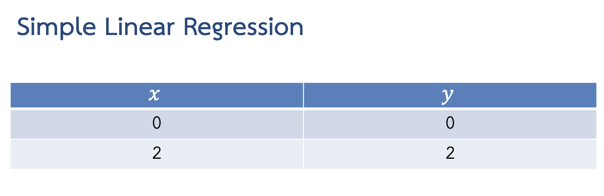

## 1). เขียนโปรแกรมสำหรับสร้างแบบจำลองเชิงเส้นด้วยวิธีลดตามความชัน พร้อมทั้งแสดงฟังก์ชันค่าใช้จ่ายในรูปของคอนทัวร์และแสดงให้เห็นถึงขั้นตอนในการปรับพารามิเตอร์ (Lecture หน้าที่ 49)

### Sample Data (โจทย์กำหนด)

```python
X = [0,2]
y = [0,2]
```
