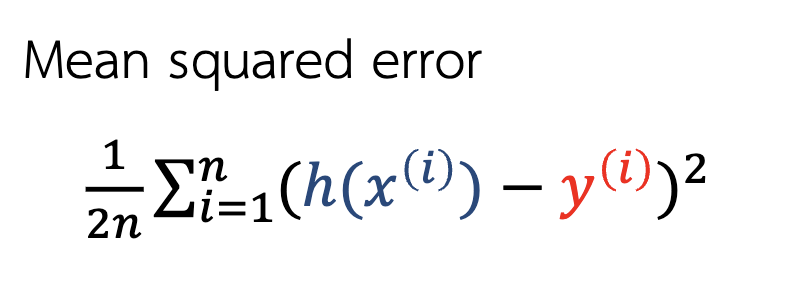
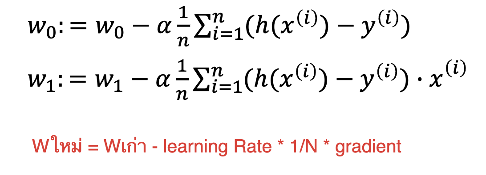
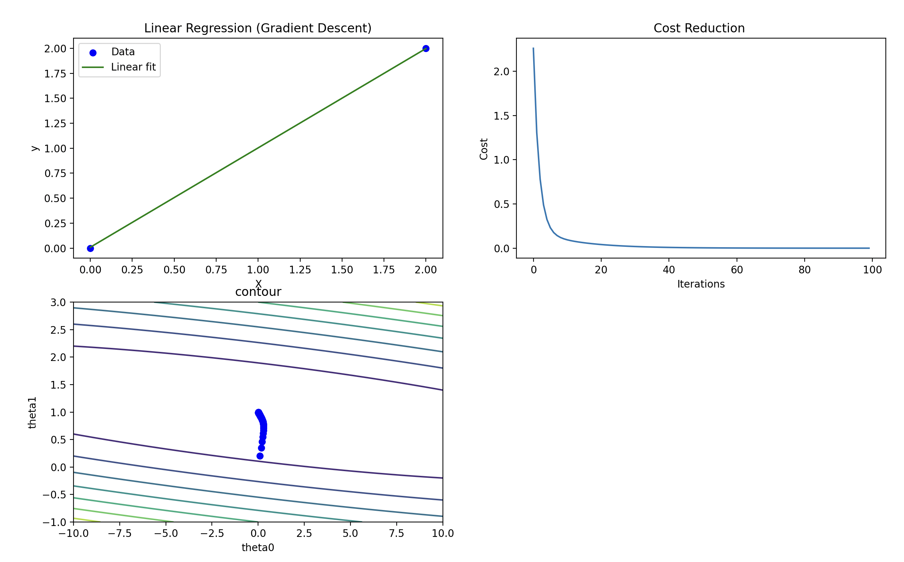

## 1). เขียนโปรแกรมสำหรับสร้างแบบจำลองเชิงเส้นด้วยวิธีลดตามความชัน พร้อมทั้งแสดงฟังก์ชันค่าใช้จ่ายในรูปของคอนทัวร์และแสดงให้เห็นถึงขั้นตอนในการปรับพารามิเตอร์ (Lecture หน้าที่ 49)

### ส่วนประกอบของ Machine Learning 


### Sample Data (โจทย์กำหนด)

```python
X = [0,2]
y = [0,2]
```


### กำหนดค่าเริ่มต้นต่างๆ

```python
alpha = 0.1 # learning rate 0.5
iterations = 100 # จำนวนรอบการทำซ้ำ

#ค่าเริ่มต้น w0 กับ w1
theta0 = 0 #กำหนดให้ theta0 (intercept) เริ่มต้น = 0
theta1 = 0 #กำหนดให้ theta1 (slope) เริ่มต้น = 0
```

### สร้าง function สำหรับคำนวณ Error โดยมาจากสมการ MSE
> จากสมการ เมื่อใช้ Function นี้เราจะได้ค่า Error ซึ่งเป็นผลต่างระหว่าง Output แบบจำลอง(y จำลอง)กับ Output ของข้อมูล(y จริง)

```python
def cost_function(X, y, theta0 ,theta1):
    m = len(y)
    cost = 0
    for i in range(m):
        y_pred = theta0 + theta1 * X[i]
        cost += (y_pred - y[i]) ** 2
    totalcost = (1/2*m)*cost
    return totalcost
```


### สร้าง function สำหรับปรับ theta0 และ Theta1 (w0, w1) โดยใช้ Gradient Descent
> โดยสมการ Gradient Descent จะปรับค่า w0, w1 ไปเรื่อยๆจนทำให้ค่า E ลดลงจนได้ค่า "ตํ่าที่สุด" โดยหลังจากดิฟแล้วก็จะได้สมการดังรูปด้านล่าง

```python
def gradient_descent(X, y, theta0, theta1, alpha, iterations):
    m = len(y)
    cost_history = []
    theta0_history = []
    theta1_history = []

    for _ in range(iterations):
        sum_errors_theta0 = 0
        sum_errors_theta1 = 0

        for i in range(m):
            y_pred = theta0 + theta1 * X[i]
            error = y_pred - y[i]
            
            #หาค่าผลรวม Gradient
            sum_errors_theta0 = sum_errors_theta0 + error
            sum_errors_theta1 = sum_errors_theta1 + error * X[i]

        #ปรับค่า w0,w1 จากสมการ w0(ใหม่) = w0(เก่า) - learningRate * 1/จำนวนข้อมูล * ผลรวม Gradient
        theta0 -= alpha * (1/m) * sum_errors_theta0 #i-=1 หรือ i=i-1
        theta1 -= alpha * (1/m) * sum_errors_theta1 
        # เก็บค่าเพื่อเอาไป plot กราฟ
        cost_history.append(cost_function(X, y, theta0, theta1))
        theta0_history.append(theta0)
        theta1_history.append(theta1)
        print("theta0 = ",theta0,"theta1 = ",theta1)
        

    return theta0, theta1, cost_history, theta0_history, theta1_history
```


### เริ่มต้นใช้งานและสร้าง plot กราฟเส้นตรง, กราฟ contour และกราฟ cost function
> กราฟ contour เมื่อเราปรับ W ค่า E ก็จะน้อยลงเรื่อยและค่อยๆลู่เข้าสู่จุดศูนย์กลาง

```python
theta0, theta1, cost_history, theta0_history, theta1_history = gradient_descent(X, y, theta0, theta1, alpha, iterations)

print("Theta0 (intercept):", theta0)
print("Theta1 (slope):", theta1)

# สร้างช่วงข้อมูล 
randomTheta0 = np.linspace(-10, 10, 100)
randomTheta1 = np.linspace(-1, 3, 100)

#คำนวณค่า Cost Function สำหรับแต่ละคู่ w0 กับ w1
box = []
for i in randomTheta0:
    row = []
    for j in randomTheta1:
        row.append(cost_function(X, y, i, j))
    box.append(row)
#print("box = ",box)


Y_pred = [theta0 + theta1 * x for x in X]

plt.figure(figsize=(13, 10))
#plt.subplots(nrows = 2,ncols=2,figsize = (10,4))

plt.subplot(2,2,1)
plt.scatter(X, y, color="blue", label="Data") 
plt.plot(X, Y_pred, color="green", label="Linear fit") 
plt.xlabel("X")
plt.ylabel("y")
plt.title("Linear Regression (Gradient Descent)")
plt.legend()

plt.subplot(2,2,2)
plt.plot(range(iterations),cost_history)
plt.xlabel("Iterations")
plt.ylabel("Cost")
plt.title("Cost Reduction ")

plt.subplot(2,2,3)
plt.contour(randomTheta0,randomTheta1, box, cmap='viridis')
plt.scatter(theta0_history, theta1_history, color="blue", label="theta_val")
plt.xlabel("theta0")
plt.ylabel("theta1")
plt.title("contour")


plt.show()
```

### ผลที่ได้จากการ Run


