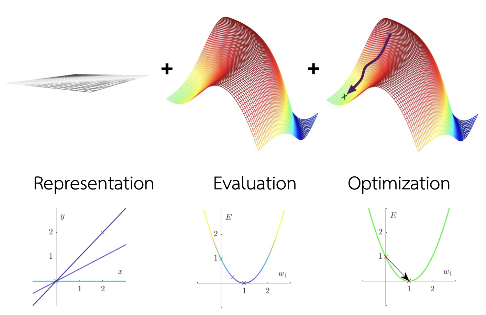

## 1). เขียนโปรแกรมสำหรับสร้างแบบจำลองเชิงเส้นด้วยวิธีลดตามความชัน พร้อมทั้งแสดงฟังก์ชันค่าใช้จ่ายในรูปของคอนทัวร์และแสดงให้เห็นถึงขั้นตอนในการปรับพารามิเตอร์ (Lecture หน้าที่ 49)

### ส่วนประกอบของ Machine Learning 


### Sample Data (โจทย์กำหนด)

```python
X = [0,2]
y = [0,2]
```


### กำหนดค่าเริ่มต้นต่างๆ

```python
alpha = 0.1 # learning rate 0.5
iterations = 100 # จำนวนรอบการทำซ้ำ

#ค่าเริ่มต้น w0 กับ w1
theta0 = 0 #กำหนดให้ theta0 (intercept) เริ่มต้น = 0
theta1 = 0 #กำหนดให้ theta1 (slope) เริ่มต้น = 0
```

### สร้าง function สำหรับคำนวน Error โดยจากสมการ MSE

```python
def cost_function(X, y, theta0 ,theta1):
    m = len(y)
    cost = 0
    for i in range(m):
        y_pred = theta0 + theta1 * X[i]
        cost += (y_pred - y[i]) ** 2
    totalcost = (1/2*m)*cost
    return totalcost
```


