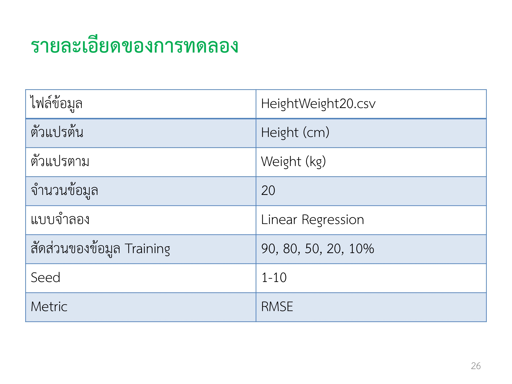

## 1. เขียนโปรแกรมเพื่อทดสอบความเที่ยงตรง (Precision) และการทดสอบความแม่นยํา (Accuracy) ของวิธี Resubstitution, Holdout และ Cross Validation โดยใช้ข้อมูล height weight โดยให้ออกแบบการทดลองเอง 

### ค่า Precision(ความเที่ยงตรง) และ ค่า Accuracy(ความแม่นยำ) คืออะไร?
> 1. ค่า Precision หรือ ค่าความเที่ยงตรง คือค่าที่บอกความสามารถของเครื่องมือวัดที่จะบอกค่าที่วัดได้ "เป็นค่าใดค่าหนึ่งเสมอ" ในที่นี้ก็คือ ค่าเบี่ยงเบนมาตราฐาน
> 2. ค่า Accuracy หรือ ค่าความแม่นยำ คือค่าที่บอกความสามารถของเครื่องมือวัดในการบอกค่าที่แท้จริงหรือ Reference Value ของสิ่งที่วัดได้ในที่นี้ก็คือ ค่าเฉลี่ย


### เราจะใช้ method ไหนในการวัดประสิทธิภาพ ของ แบบจำลอง Linear Regssion?

>1. Holdout method:
> จะเป็นการแบ่งข้อมูลออกเป็น 2 ส่วนได้แก่ Train Set และ Test Set โดยเราจะใช้ข้อมูล Train ในการสร้าง model และใช้ข้อมูล Test ในการทดสอบประสิทธิภาพของ model นั้น  

>2. cross_Validation:
> จะเป็นการแบ่งข้อมูลออกเป็นหลายๆ Fold โดยที่แต่ละ fold จะมีการแบ่งข้อมูลเป็น Train Set และ Test Set นำข้อมูลที่แบ่งแล้วไปทดสอบเพื่อดูว่าการแบ่งแบบใดทำให้ข้อมูลเราทำนายได้ดีที่สุด

>3. Resubstitution:
> ใช้ข้อมูลทั้งหมดใน Train model และทำนายผล

### ผลการทดลองที่ได้จากโปรแกรม Weka
1. การทดลองความเที่ยงตรง ของวิธี Holdout
> รายละเอียดการทดลอง

>ผลที่ได้


2. การทดลองความเที่ยงตรง ของวิธี k-fold cross-validation
> รายละเอียดการทดลอง

>ผลที่ได้


3. การทดลองความเที่ยงตรงและความแม่นยำเมื่อข้อมูลมากขึ้น
> รายละเอียดการทดลอง

>ผลที่ได้


4. การทดลองความเที่ยงตรงและความแม่นยำโดย method ทั้งหมด
 > รายละเอียดการทดลอง

>ผลที่ได้


### ลองเขียนโปรเเกรโดยใช้ sklearn
> สร้าง function สำหรับ คำนวนค่า RMSE ด้วย method ต่างๆ

```python
def resubstitution(X, y):
    model = LinearRegression()  # สร้างโมเดล Linear Regression
    model.fit(X, y)  # ฝึกโมเดลด้วยข้อมูลทั้งหมด
    y_pred = model.predict(X)  # ทำนายผลสำหรับข้อมูลทั้งหมด
    rmse = np.sqrt(mean_squared_error(y, y_pred))  # คำนวณค่า RMSE
    return rmse  # คืนค่า RMSE
```
```python
def holdout(X, y, random_state):
    # แบ่งข้อมูลเป็นส่วนฝึกอบรม (90%) และส่วนทดสอบ (10%)
    X_train, X_test, y_train, y_test = train_test_split(X, y, train_size=0.9, random_state=random_state)
    model = LinearRegression()  # สร้างโมเดล Linear Regression
    model.fit(X_train, y_train)  # ฝึกโมเดลด้วยข้อมูลฝึกอบรม
    y_test_pred = model.predict(X_test)  # ทำนายผลสำหรับข้อมูลทดสอบ
    rmse = np.sqrt(mean_squared_error(y_test, y_test_pred))  # คำนวณค่า RMSE
    return rmse  # คืนค่า RMSE
```
```python
def cross_Validation(X, y, random_state):
    kf = KFold(n_splits=10, shuffle=True, random_state=random_state)  # แบ่งข้อมูลเป็น 10 folds
    model = LinearRegression()  # สร้างโมเดล Linear Regression
    # คำนวณคะแนน MSE โดยใช้ cross-validation และเก็บค่าคะแนนที่ได้เป็นลบของค่า MSE
    mse_scores = cross_val_score(model, X, y, cv=kf, scoring='neg_mean_squared_error')
    rmse_scores = np.sqrt(-mse_scores)  # คำนวณค่า RMSE โดยการหาค่ารากที่สองของ -mse_scores
    return rmse_scores  # คืนค่า RMSE สำหรับแต่ละ fold
```


